# Write-up 0: template

**Name:** Louise Lima  
**Student ID:** llima23  
**Date:** 11/11/2025  

---

## HW1 Part A
HW Part A Answer the following questions:

Fill in the blank: "Git provides a *record* of content changes"

Which git command shows you the historical graphical representation of branchin>
   *git log*

---

## HW1 Part B
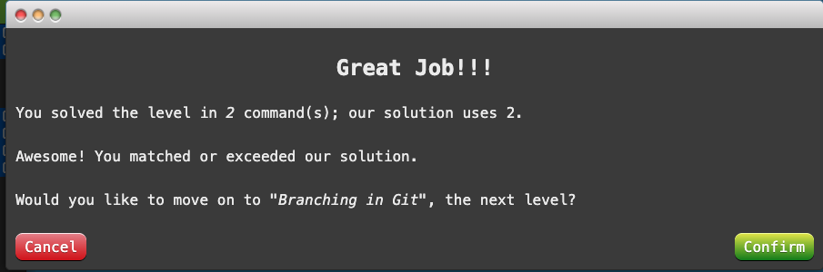

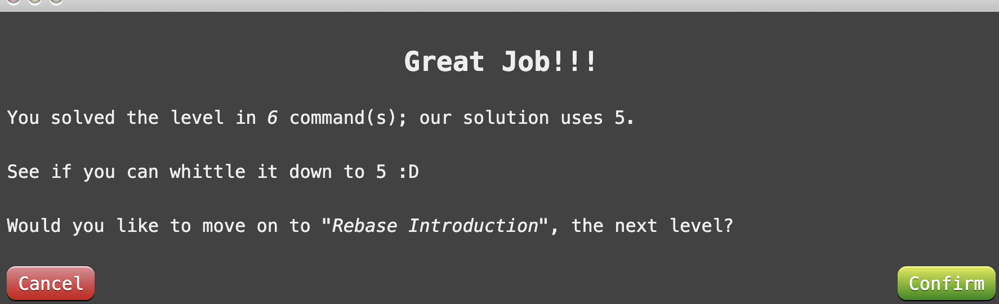
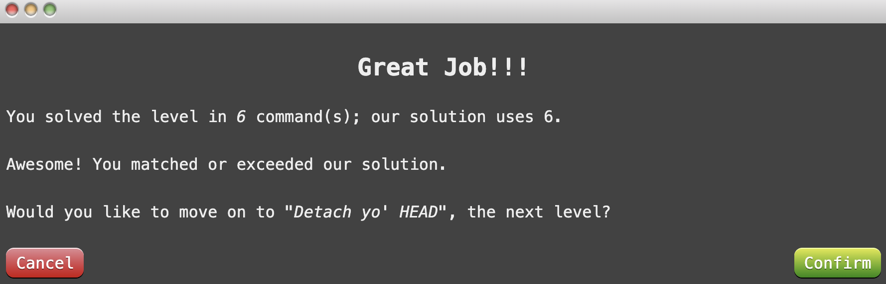
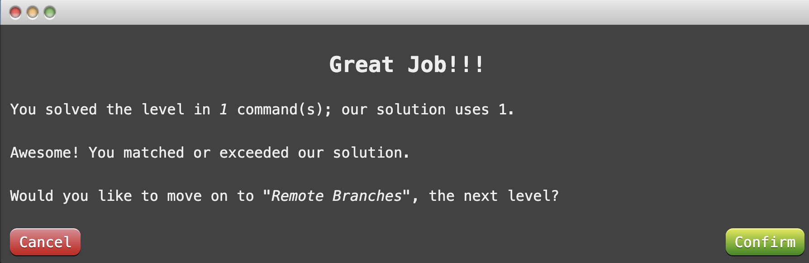
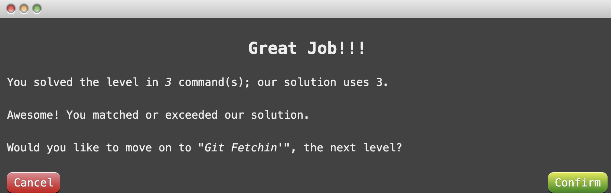
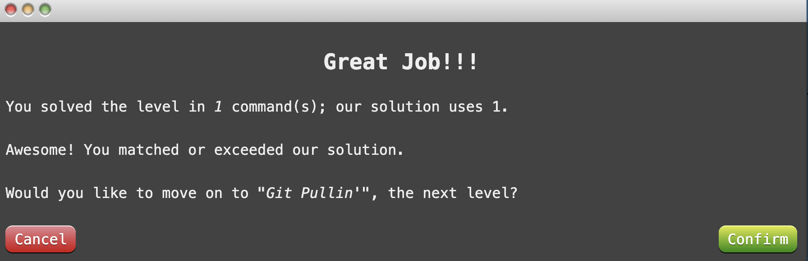
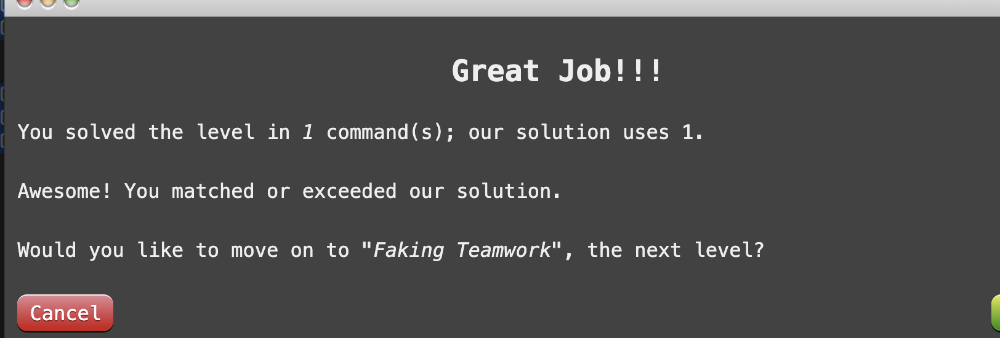
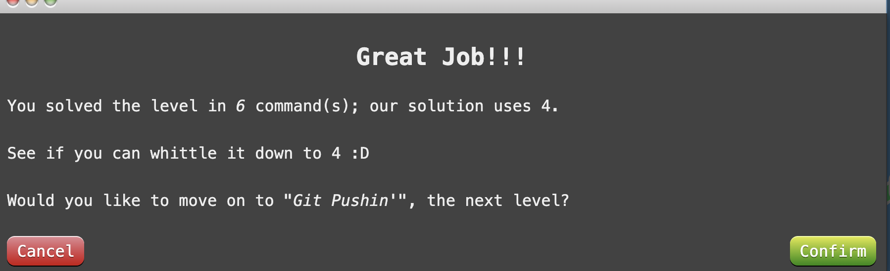
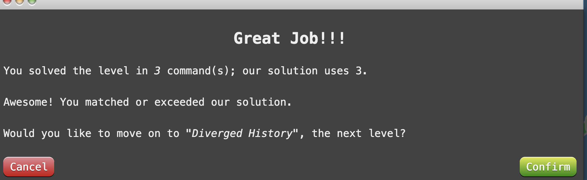
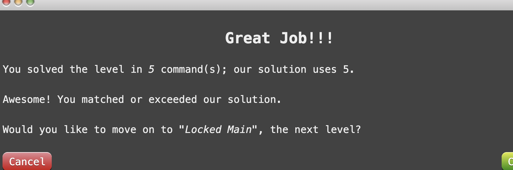
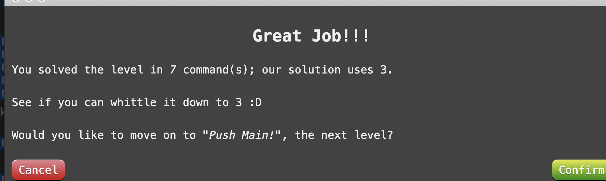
